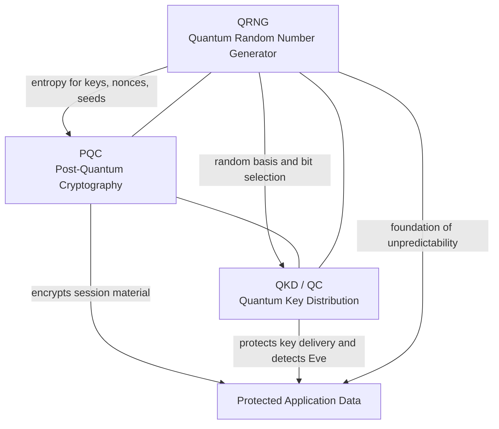
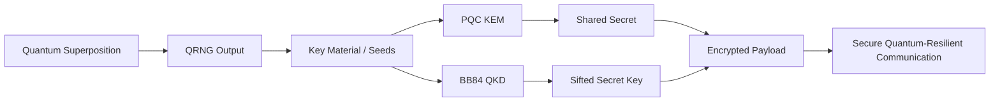
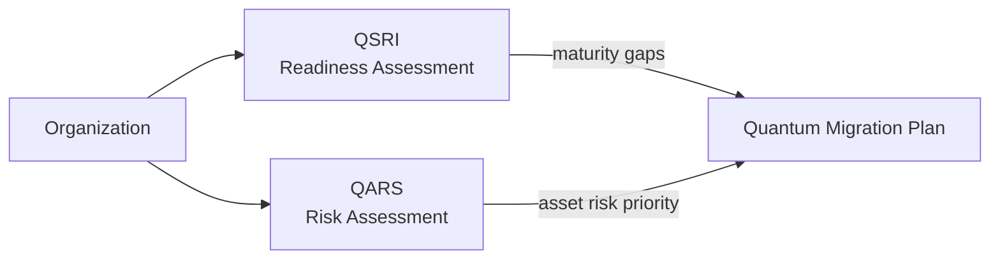
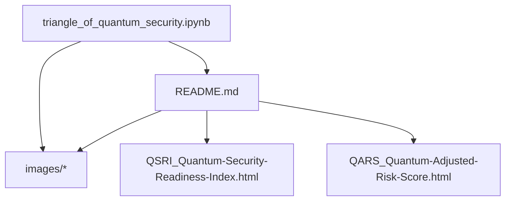

# Graphified Overview

This file turns the project into a set of quick visual graphs so the architecture, workflow, and deliverables are easy to scan.

## 1. Triangle Architecture

## 2. Security Workflow

## 3. Assessment Tooling

## 4. Repo Deliverables

## 5. Reading Order

1. Start with the architecture graph to understand how QRNG, PQC, and QKD reinforce one another.
2. Follow the workflow graph to see how randomness becomes practical communication security.
3. Use QSRI and QARS together to map readiness and prioritize migration risk.
4. Open the notebook and images for the implementation-level walkthrough.
